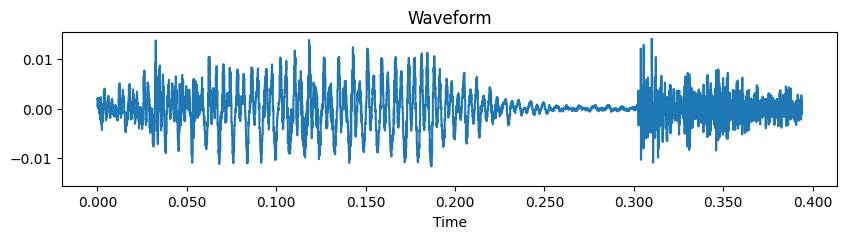
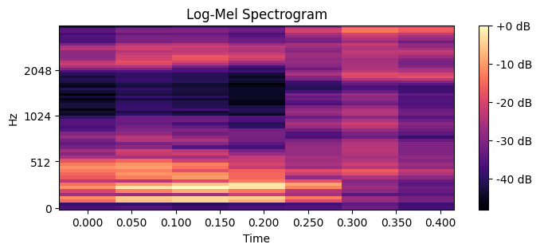

# Automatic Speech Recognition on the Free Spoken Digit Dataset (FSDD)

---

## Table of Contents

1. [ASR History](#asr-history)
2. [Problem Statement](#problem-statement)
3. [Dataset](#dataset)
4. [ASR Pipeline](#asr-pipeline)
5. [Challenges in ASR](#challenges-in-asr)
6. [Algorithms Implemented](#algorithms-implemented)
7. [Quick Start](#quickstart)
8. [Project Structure](#project-structure)
9. [Experimental Results](#experimental-results)
10. [Record‑Your‑Own Demo](#recordyourown-demo)
11. [Limitations & Future Work](#limitations--future-work)

---

## ASR History

- **1952 – Audrey:** Bell Labs’ first digit recogniser
- **1960s – DTW:** dynamic time warping aligns variable speaking speed
- **1980s – GMM‑HMM:** Rabiner & colleagues formalise the HMM‑based pipeline
- **2012 – Deep Speech / CTC:** deep neural networks replace GMMs; CTC enables end‑to‑end training
- **2020 – Self‑supervised pre‑training:** Wav2Vec 2.0, HuBERT, Whisper learn from thousands of hours of unlabeled speech

---

## Problem Statement

The goal is to **recognise isolated spoken digits (0–9)** from short audio clips.  We build and compare three classical ASR approaches:

| Abbrev. | Algorithm                                       | Key idea                                                                                                         |
| ------- | ----------------------------------------------- | ---------------------------------------------------------------------------------------------------------------- |
| **DTW** | 1‑Nearest‑Neighbour with *Dynamic Time Warping* | Aligns test MFCC sequence to each training sequence and picks the smallest distance                              |
| **HMM** | *Gaussian‑Mixture* Hidden Markov Models         | Learns state‑transition and emission probabilities per digit, then scores a test sequence via Viterbi            |
| **CNN** | 3‑layer *Convolutional Neural Network*          | Classifies fixed‑size log‑Mel spectrogram “images” using deep CNN with BatchNorm, Dropout, and Adaptive Pooling. |

---

## Dataset – Free Spoken Digit Dataset (FSDD)

- **Size:** ∼3,000 WAV files, 8 kHz, mono, ≈1 s per clip
- **Speakers:** 6
- **Licence:** Creative Commons BY 4.0
- **Repo:** [https://github.com/Jakobovski/free-spoken-digit-dataset](https://github.com/Jakobovski/free-spoken-digit-dataset)

---

## ASR Pipeline

1. **Pre‑processing:**  Normalise volume, optional Voice Activity Detection (VAD)
2. **Feature Extraction:**
   - *MFCC + ΔMFCC* for DTW/HMM
   - *Log‑Mel Spectrogram* (1×64×128) for the CNN
3. **Acoustic Model & Classifier:** DTW, GMM‑HMM, or CNN
4. **Decoding / Inference:**  1‑NN vote (DTW), Viterbi (HMM), or Softmax (CNN)
5. **Evaluation:**  Digit Accuracy, Confusion Matrix





---

## Challenges in ASR

Automatic Speech Recognition (ASR) systems face a wide range of challenges:

- **Speaker variability:** Differences in pitch, accent, speed, and pronunciation between speakers can reduce model generalisation
- **Background noise:** Environmental sounds and microphone quality introduce signal distortions
- **Coarticulation and prosody:** The way sounds blend together in natural speech can confuse phoneme boundaries
- **Data scarcity:** Training high-performance ASR models typically requires large annotated datasets
- **Out-of-vocabulary words:** Traditional systems struggle with new or rare terms not seen during training
- **Latency and computation:** Real-time applications demand fast and resource-efficient models
- **Language diversity:** Supporting multiple languages, dialects, and code-switching adds complexity

These challenges are especially significant for low-resource languages and real-time or noisy settings.

---

## Algorithms Implemented

### Dynamic Time Warping (DTW)

- *Pros*: Zero training, interpretable distance path
- *Cons*: O(N⋅T²) runtime, sensitive to noise
- Uses MFCC + ΔMFCC features
- Distance computed using `dtaidistance.dtw`

### Gaussian‑Mixture HMM

- 5 hidden states, 4 Gaussians/state, diagonal covariance
- Trained per digit with Baum‑Welch algorithm
- Inference using Viterbi log‑likelihood
- Implemented using `hmmlearn.hmm.GMMHMM`

### Convolutional Neural Network

- Input: 1×64×128 log-Mel spectrogram
- Architecture:
  - Conv2D(1→32) → BatchNorm → ReLU → MaxPool
  - Conv2D(32→64) → BatchNorm → ReLU → MaxPool
  - Conv2D(64→128) → BatchNorm → ReLU → AdaptiveAvgPool
  - Flatten → Dropout(0.3) → Linear(128→10)
- Normalized input tensors
- Optimizer: Adam (lr = 1e‑3)
- Scheduler: StepLR(step\_size=20, gamma=0.5)
- Loss: CrossEntropy
- Trained for 300 epochs with best model checkpointing

---

## Quick Start

Clone the repository

```bash
$ git clone https://github.com/z0lt4np4l1nk4s/AutomaticSpeechRecognition
$ cd AutomaticSpeechRecognition
```

Environment setup *For Linux/macOS:*

```bash
# Navigate to your project directory
# Create a Python virtual environment
python3 -m venv venv

# Activate the environment
source venv/bin/activate

# Install dependencies
pip install -r requirements.txt
```

*For Windows:*

```bash
# Navigate to your project directory in PowerShell or Command Prompt
# Create a Python virtual environment
python -m venv venv

# Activate the environment
.\venv\Scripts\activate

# Install dependencies
pip install -r requirements.txt
```

Launch Jupyter / VS Code and open **notebook.ipynb** then run the notebook **top‑to‑bottom**

---

## Project Structure

```text
├── assets/
├── notebook.ipynb
├── requirements.txt
└── README.md
```

---

## Experimental Results

| Model    | Accuracy (FSDD test split) |
| -------- | -------------------------- |
| DTW 1‑NN | **60 %**                   |
| GMM‑HMM  | **99 %**                   |
| CNN      | **92 %**                   |

Confusion matrices are generated automatically in the notebook (`sklearn.metrics.ConfusionMatrixDisplay`)

---

## Record‑Your‑Own Demo

```python
# Inside the notebook, Section 7:
import sounddevice as sd, scipy.io.wavfile as wav
fs = 8000; seconds = 1
sd.rec(int(seconds*fs), samplerate=fs, channels=1)
# speak your digit → press ▶
```

Predictions from all three models are printed; compare which algorithm copes best with an **unseen speaker**

---

## Limitations & Future Work

- **Isolated digits** only – no continuous speech or language model
- Small dataset → models may overfit speakers & noise profile
- HMM configuration (states, mixtures) was not exhaustively tuned
- CNN uses fixed‑length input; RNN/CTC would allow variable‑length sequences

**Next steps**: data augmentation, fine‑tuning `wav2vec2‑base` on FSDD, adding CTC loss, streaming inference

---